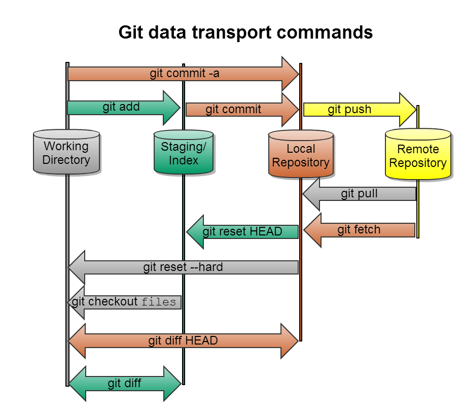

## Git Tutorial

### git 常用命令大全



### add ssh
   * cat ~/.ssh/id_rsa.pub
   * ls -al ~/.ssh  --列出证书
   * ssh-keygen -t rsa -b 4096 -C "1417376255@qq.com"  --创建ssh证书
   * ssh-keygen -t rsa -C "youremail@example.com"  --创建SSH Key
   * eval "$(ssh-agent -s)"  --??  
   * ssh-add ~.ssh/id_rsa  --??
   * clip < ~/.ssh/id_rsa.pub  --克隆
### Create Repository
   * git init --初始化Git仓库
   * sudo git init --bare sample.git --创建裸仓库
   * git add readme --添加文件到版本库
   * git add readme.txt --编写一个 readme.txt 文件
   * git commit -m "info" --用命令把文件提交到仓库，info本次提交的说明

### Git Basics
   * git add --把要提交的所有修改放到暂存区
   * git commit --一次性把暂存区的所有修改提交到分支
   * git checkout --把误删文件恢复
   * git checkout -- file --丢弃工作区的修改
   * git diff --查看具体修改内容
   * git diff HEAD -- filename
   * git log --查看历史记录（最近到最远显示），以便确定要回退到哪个版本
   * git log --pretty=oneline --查看减少后的历史记录
   * git reset --hard HEAD^ --返回到上个版本（上上个版本：HEAD^^；往上100个版本：HEAD~100）
   * git reset --hard 版本号 --回到删除的版本（当前命令行窗口未关闭；版本号没必要写全）
   * git reset HEAD file --将暂存区的修改退回工作区   * sudo chown -R git:git sample.git  --改变权限

   * git reflog --查看命令历史，以便确定要回到未来的哪个版本
   * git rm --用于删除一个文件
   * git status --查看修改状态
  
### Remote Repository
   * git clone  --克隆
   * git clone `ssh://userName@ipAddress:port/path/repository.git`
   * git clone `../test/sample.git`
   * git pull  --抓取远程分支
   * git push -u origin master  --推送master分支并关联本地与远程的分支(第一次加-u)
   * git push origin **branch-name**  --推送本地分支到远程库
   * git push origin **tagname** --推送一个本地标签
   * git push origin master  --推送分支
   * git push origin :**branchName**          --删除远程分支
   * git push origin :refs/tags/**tagname**  --删除远程标签
   * git push origin --delete **branchName**  --删除远程分支
   * git push origin --delete **tagname**   --删除远程标签
   * git push origin --tags --推送全部尚未推送到远程的本地标签
   * git remote 不带参数，列出已经存在的远程分支
   * git remote add origin git@github.com:chenyexing/learngit.git --Adds a remote named **name** for the repository at **url**
   * git remote add origin git@server-name:path/repo-name.git --关联一个远程库
   * git remote -v | --verbose 列出详细信息, 如果有子命令，-v 需要放在git remote与子命令中间。
 

### Branch Manage
   * git branch --查看分支
   * git branch -a  --查看所有分支(远程)
   * git branch -m dev1 dev2  --重命名分支
   * git branch **name** --创建分支
   * git branch --查看当前分支（当前分支前会标*）
   * git branch -d **name** --删除分支
   * git branch -D **name** --强行删除没有合并过的分支
   * git branch --set-upstream branch-name origin/branch-name --建立本地分支和远程分支的关系
   * git branch --set-upstream-to=origin/dev dev --建立本地分支和远程分支的关系
   * git cherry-pick 62ecb3  --合并部分提交到当前分支
   * git checkout -b branch-name --创建+切换分支
   * git checkout -b branch-name origin/branch-name --本地创建+切换和远程分支对应的分支(本地和远程分支的名称最好一致)
   * git log --graph --查看分支合并图
   * git merge **name** --合并某分支到当前分支
   * git merge **name** --no-ff -m "merge" -dev
            --禁用 Fast formard 模式(删除分支后,丢掉分支信息,看不出历史合并记录)
   * git remote --查看远程库信息
   * git remote -v --查看详细远程库信息
   * git stash --“储藏”当前工作现场
   * git stash list --查看临时储藏的工作现场
   * git stash pop --回到工作现场

### Label Manage
   * git tag **name** --打标签
   * git tag --查看所有标签
   * git show **tagname** --查看标签信息
   * git tag -a **tagname** -m **note** --创建带有说明的标签
   * git tag -s **tagname** -m **note** --用PGP签名标签
   * git tag -d **tagname** --删除标签（本地）

### Others
   * gitignore  --.gitignore文件本身要放到版本库里，并且可以对.gitignore做版本管理
   * git log  --查看git日志 
   * git log --pretty=oneline  --简化log
   * git log --graph  --命令可以看到分支合并图
   * git log --graph --pretty=oneline --abbrev-commit
   * git config --list  --显示当前配置信息
   * git config --global color.ui true  --让Git显示颜色
   * git config --global user.name "Your Name"  --global参数, 表示你这台机器上所有的Git仓库都会使用这个配置，
   * git config --global user.email "email@example.com"	
   * git config --global alias.st status
   * git config --global alias.co checkout
   * git config --global alias.ci commit
   * git config --global alias.br branch
   * git config --global alias.unstage 'reset HEAD'
   * git config --global alias.last 'log -1'
   * git config --global alias.lg "log --color --graph --pretty=format:  
     > '%Cred%h%Creset -%C(yellow)%d%Creset %s %Cgreen(%cr) %C(bold blue)<%an>%Creset' --abbrev-commit"
   * .gitconfig  --当前用户的Git配置文件放在用户主目录下的一个隐藏文件中
```
	cat .gitconfig
	[alias]
	    co = checkout
	    ci = commit
	    br = branch
	    st = status
	[user]
	    name = Your Name
	    email = your@email.com  
``` 	
     
###	notice

   * git远程库一般包含master和dev两个分支
   * 从远程库拉取到相应代码后需要在本地创建dev分支
   * 日常开发在dev分支上进行，需求迭代时提交至远程库dev分支，发布前提交至master分支，并且需要根据每次需求文档的id编号，对提交内容打标
   * 修复bug时，在本地创建issue+id的分支，修复完成后，合并至本地master分支并删除新创建的分支，然后推送至远程库master分支，并进行打标
   * 代码提交至远程库（master/dev）分支前，需要git pull拉取远程库最新版本，详情内有对应的冲突解决方案
   * 合并分支时不建议使用git merge dev（会丢失分支合并的状态），建议使用git merge --no-ff -m "merge with no-ff" dev
   * 本地分支和远程库同步建议:  
       * master分支是主分支，因此要时刻与远程同步	
       * dev分支是开发分支，团队所有成员都需要在上面工作，所以也需要与远程同步	
	   * bug分支只用于在本地修复bug，就没必要推到远程了，除非老板要看看你每周到底修复了几个bug	
	   * feature分支是否推到远程，取决于你是否和你的小伙伴合作在上面开发
   * 恢复上一个版本:
       * git checkout -- readme.txt 还没有被放到暂存区, 撤销修改就回到和版本库一模一样的状态   
       * git reset HEAD readme.txt  已经添加到暂存区后，又作了修改，现在，撤销修改就回到添加到暂存区后的状态。
   * git checkout -b branch-name origin/branch-name --本地创建和远程分支对应的分支(本地和远程分支的名称最好一致)